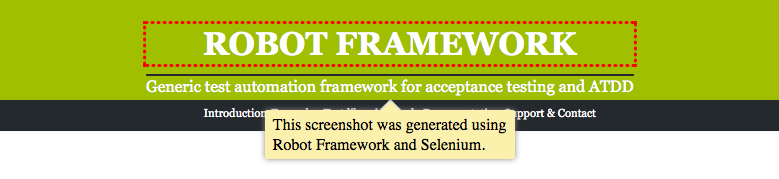

Document with an annotated screenshot
=====================================

While Selenium_ has built-in support for capturing whole page screenshots, usually screenshots must be cropped and some times also annotated to make them useful in a documentation.

.. _Selenium: http://docs.seleniumhq.org/

A Robot Framework library called SeleniumScreenshots_ provides a collection of re-usable keywords for cropping and annotating screenshots.

.. _SeleniumScreenshots: http://pypi.python.org/pypi/robotframework-seleniumscreenshots

A cropped and annotated screenshot could look like this:

.. code:: robotframework
   :class: hidden

   *** Settings ***

   Library  SeleniumLibrary
   Library  SeleniumScreenshots

   Suite Teardown  Close all browsers

   *** Variables ***

   ${BROWSER}  headlessfirefox

   *** Keywords ***

   Highlight heading
       [Arguments]  ${locator}
       Update element style  ${locator}  margin-top  0.75em
       Highlight  ${locator}

   *** Test Cases ***

   Take an annotated screenshot of RobotFramework.org
       Open browser  http://robotframework.org/  browser=${BROWSER}

       Highlight heading   css=h1

       ${note1} =  Add pointy note
       ...    css=h1
       ...    This screenshot was generated using Robot Framework and Selenium.
       ...    width=250  position=bottom
       Capture and crop page screenshot  robotframework.png
       ...    css=h1  ${note1}

.. note::

   The image cropping feature for **robotframework-seleniumscreenshots**
   requires PIL_ or Pillow_.

.. _PIL: https://pypi.python.org/pypi/PIL
.. _Pillow: https://pypi.python.org/pypi/Pillow
