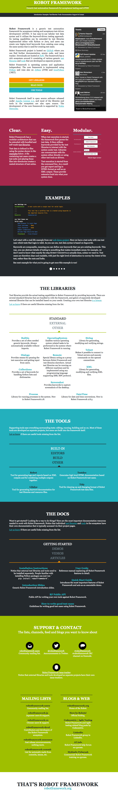

Document with a screenshot
==========================

The fun with **sphinxcontrib-robotframework** starts in using it together
with SeleniumLibrary_.

.. _SeleniumLibrary: https://github.com/robotframework/robotframework-seleniumlibrary

These packages together  would allow you to navigate any website, take
screenshots when required and finally embed those screenshot into this very
Sphinx-documentation. All this with just ``sphinx-build``:

.. code:: robotframework

   *** Settings ***

   Library  SeleniumLibrary

   Suite Teardown  Close all browsers

   *** Variables ***

   ${BROWSER}  headlessfirefox

   *** Test Cases ***

   Capture a screenshot of RobotFramework.org
       Open browser  http://robotframework.org/  browser=${BROWSER}
       Capture page screenshot  robotframework.png
